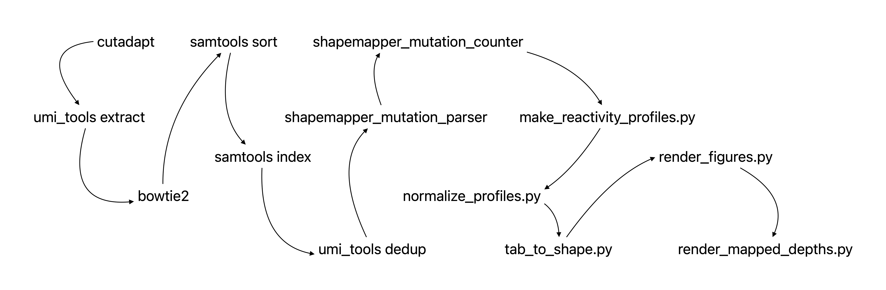

**Work flow of shapemapper2**

This is my log adjusted according to library of the UMI shape-seq.

Almost changes were in the preparation of the input sam files.



If you want to read original doc, see [this](README_RAW.md).

Align preparation:

```shell
bowtie2-build RAD6.fa ../fat/index/rad6
```

Sample config:

```shell
SAMPLE="NJU6605"
THREAD="16"
```

Sample handle1 (with dedup):

```shell

# cutadapt
cutadapt -a AGATCGGAAGAGCACA -A AGATCGGAAGAGCGT \
  -O 4 -m 36 -o ${SAMPLE}/R1.fq.gz -p ${SAMPLE}/R2.fq.gz \
  -j ${THREAD} ${SAMPLE}/*_R1_001.fastq.gz ${SAMPLE}/*_R2_001.fastq.gz \
  2>${SAMPLE}/cutadapt.log

# umi_tools extract
umi_tools extract --extract-method=regex \
  -I ${SAMPLE}/R1.fq.gz --read2-in=${SAMPLE}/R2.fq.gz \
  --bc-pattern="^(?P<umi_1>.{6}).*(?P<discard_1>.{6})$" \
  --bc-pattern2="^(?P<umi_2>.{6}).*(?P<discard_2>.{6})$" \
  -S ${SAMPLE}/clean.R1.fq.gz --read2-out=${SAMPLE}/clean.R2.fq.gz \
  2>${SAMPLE}/umi_tools_extract.log

# bowtie2
bowtie2 -p 20 --local --sensitive-local \
  --mp 3,1 --rdg 5,1 --rfg 5,1 --dpad 30 --maxins 800 \
  --ignore-quals --no-unal -x ../fat/index/rad6 \
  -1 ${SAMPLE}/clean.R1.fq.gz -2 ${SAMPLE}/clean.R2.fq.gz \
  -S ${SAMPLE}/raw.sam 2>&1 |
  sed '/^Warning: /d' |
  tee ${SAMPLE}/bowtie2.log

# samtools sort
samtools sort ${SAMPLE}/raw.sam -o ${SAMPLE}/sorted.bam

# samtools index
samtools index -@ ${THREAD} ${SAMPLE}/sorted.bam

# umi_tools dedup
umi_tools dedup \
  --paired --output-stats=${SAMPLE}/dedup \
  --out-sam -S ${SAMPLE}/dedup.sam \
  -I ${SAMPLE}/sorted.bam

# shapemapper_mutation_parser
./internals/bin/shapemapper_mutation_parser \
  -i ${SAMPLE}/dedup.sam -o ${SAMPLE}/mut \
  -w -m 10 --max_internal_match 5 --min_qual 30 \
  --max_paired_fragment_length 800 --max_primer_offset 10

# shapemapper_mutation_counter
./internals/bin/shapemapper_mutation_counter \
  -i ${SAMPLE}/mut --warn_on_no_mapped \
  -c ${SAMPLE}/mutation_counts.txt \
  --length "519" --n_primer_pairs "-999"

```

Sample handle2 (undedup):

```shell
# cutadapt
cutadapt -a AGATCGGAAGAGCACA -A AGATCGGAAGAGCGT \
  -O 4 -m 36 -o ${SAMPLE}/R1.fq.gz -p ${SAMPLE}/R2.fq.gz \
  -j ${THREAD} ${SAMPLE}/*_R1_001.fastq.gz ${SAMPLE}/*_R2_001.fastq.gz \
  2>${SAMPLE}/cutadapt.log

# umi_tools extract
umi_tools extract --extract-method=regex \
  -I ${SAMPLE}/R1.fq.gz --read2-in=${SAMPLE}/R2.fq.gz \
  --bc-pattern="^(?P<umi_1>.{6}).*(?P<discard_1>.{6})$" \
  --bc-pattern2="^(?P<umi_2>.{6}).*(?P<discard_2>.{6})$" \
  -S ${SAMPLE}/clean.R1.fq.gz --read2-out=${SAMPLE}/clean.R2.fq.gz \
  2>${SAMPLE}/umi_tools_extract.log

# bowtie2
bowtie2 -p 20 --local --sensitive-local \
  --mp 3,1 --rdg 5,1 --rfg 5,1 --dpad 30 --maxins 800 \
  --ignore-quals --no-unal -x ../fat/index/rad6 \
  -1 ${SAMPLE}/clean.R1.fq.gz -2 ${SAMPLE}/clean.R2.fq.gz \
  -S ${SAMPLE}/raw.sam 2>&1 |
  sed '/^Warning: /d' |
  tee ${SAMPLE}/bowtie2.log

# shapemapper_mutation_parser
./internals/bin/shapemapper_mutation_parser \
  -i ${SAMPLE}/raw.sam -o ${SAMPLE}/mut \
  -w -m 10 --max_internal_match 5 --min_qual 30 \
  --max_paired_fragment_length 800 --max_primer_offset 10

# shapemapper_mutation_counter
./internals/bin/shapemapper_mutation_counter \
  -i ${SAMPLE}/mut --warn_on_no_mapped \
  -c ${SAMPLE}/mutation_counts.txt \
  --length "519" --n_primer_pairs "-999"

```

Modify and untreated compare:

```shell
MODIFY="NJU6605"
UNTREATED="NJU6606"

# make_reactivity_profiles.py
python3 ./internals/bin/make_reactivity_profiles.py \
  --fa RAD6.fa --rna "RAD6" \
  --counts ${MODIFY}/mutation_counts.txt ${UNTREATED}/mutation_counts.txt \
  --out CalcProfile.txt --mindepth 5000 --maxbg 0.05 --random-primer-len 6

# normalize_profiles.py
python3 ./internals/bin/normalize_profiles.py \
  --warn-on-error \
  --tonorm CalcProfile.txt --normout profile.txt

# tab_to_shape.py
python3 ./internals/bin/tab_to_shape.py \
  --infile profile.txt --shape RAD6.shape --map RAD6.map \
  --varna RAD6_varna_colors.txt --ribosketch RAD6_ribosketch_colors.txt

# render_figures.py
python3 ./internals/bin/render_figures.py \
  --infile profile.txt --mindepth 5000 --maxbg 0.05 \
  --plot RAD6_profiles.pdf --hist RAD6_histograms.pdf --title "RNA: RAD6"

# render_mapped_depths.py
python3 ./internals/bin/render_mapped_depths.py \
  --rna-name RAD6 --tsv profile.txt --out RAD6_mapped_depths.pdf

```